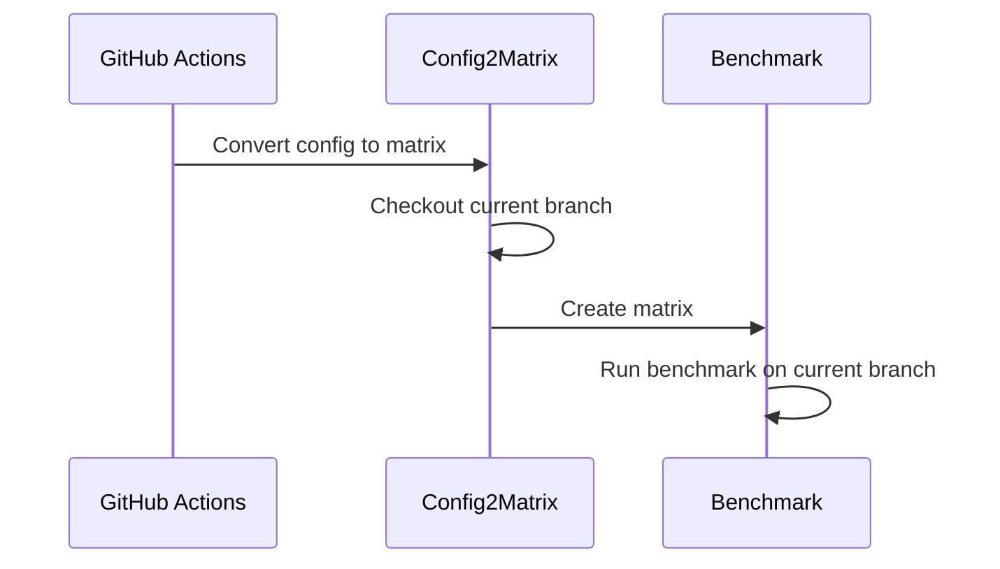
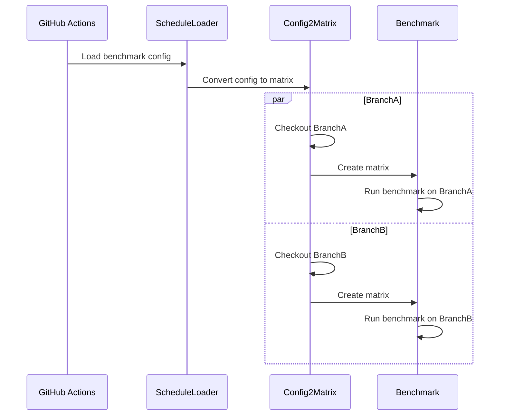

# Diagrams

## Simplest way to dispatch benchmark for multiple configurations

Simplest way to dispatch benchmark for multiple configurations is to define benchmark config in config.yaml file. The `benchmark_config2matrix.sh` will convert the config to GitHub Actions matrix. This sequence diagram indicate how to dispatch the benchmark for multiple configurations.



## Schedule Loader to dispatch benchmark for multiple branches

Simplest way is most preffered way, but GitHub Actions `schedule` event only invoke on default branch. This means that we need to dispatch the benchmark for multiple branches if we want to run other branch than default. This sequence diagram indicate how to dispatch the benchmark for multiple branches.



# Spec

## Benchmark config

Benchmark config has `type: config` and it defines `jobs` array. jobs array will templating the root element and create array of job. Each job will be dispatched by GitHub Actions matrix.

```yaml
type: config # Indicate config type. config is used to define the benchmark configuration
apt-tools: string # apt tool names to install (space separated)
dotnet-version: numbert  # dotnet version to install
benchmark-expire-min: number # Benchmark expire time in minutes
benchmark-location: "japaneast" # Benchmark location, indicate azure region
benchmark-timeout-min: number # Benchmark timeout in minutes
benchmark-client-run-script-path: "stringh" # Benchmark client run script path
benchmark-client-run-script-args: 'string' # Benchmark client run script args
benchmark-server-run-script-path: "string" # Benchmark server run script path
benchmark-server-run-script-args: 'string' # Benchmark server run script args
benchmark-server-stop-script-path: "string" # Benchmark server stop script path
jobs:
  - tags: string # Metrics Tags (comma separated)
    protocol: h2c|h2|h3 # gRPC Protocol
    channels: number # gRPC Channels
    streams: number # gRPC Streams
    serialization: messagepack|memorypack # Serialization
  # you can define more
```

This config will be converted to GitHub Actions matrix json like follows.

```json
{
  "include": [
    {
      "type": "config",
      "apt-tools": "libmsquic",
      "dotnet-version": "8.0",
      "benchmark-expire-min": 15,
      "benchmark-location": "japaneast",
      "benchmark-timeout-min": 10,
      "benchmark-client-run-script-path": ".github/scripts/benchmark-client-run.sh",
      "benchmark-server-run-script-path": ".github/scripts/benchmark-server-run.sh",
      "benchmark-server-stop-script-path": ".github/scripts/benchmark-server-stop.sh",
      "benchmark-client-run-script-args": "--run-args \"-u http://${BENCHMARK_SERVER_NAME}:5000 --protocol h2c -s CI --rounds 3 --channels 28 --streams 1 --serialization messagepack --validate true --tags legend:messagepack-h2c-linux,streams:1,protocol:h2c\" --build-args \"\"",
      "benchmark-server-run-script-args": "--run-args \"-u http://0.0.0.0:5000 --protocol h2c --validate true --tags legend:messagepack-h2c-linux,streams:1,protocol:h2c\" --build-args \"\""
    }
  ]
}
```

## Loader config

`type: loader` config defines `branch & config path` array. The loader will load the config for each branch and dispatch the benchmark. The loader will checkout the branch and run the config2matrix.

```yaml
type: loader # Indicate config type. loader is used to define the benchmark loader configuration
branch-configs:
  - branch: "string" # Branch name
    config-path: "stringl" # Config path
  # you can define more
```
