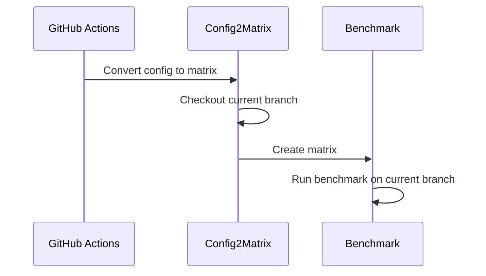
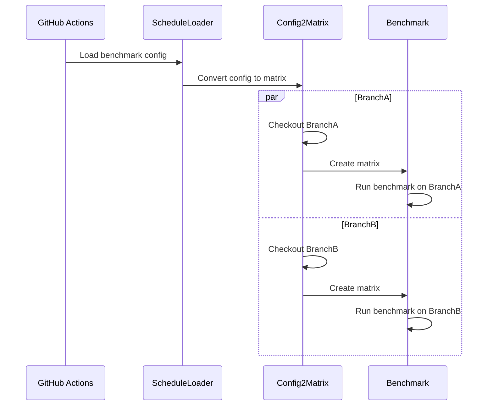

# Diagrams

## Benchmark Config to dispatch benchmark for multiple configurations

`type: config` config defines `job` array. The `benchmark_config2matrix.sh` will convert the config to GitHub Actions matrix.

## Schedule Loader to dispatch benchmark for multiple branches

GitHub Actions schedule only invoke on default branch, this means that we need to dispatch the benchmark for multiple branches. This sequence diagram indicate how to dispatch the benchmark for multiple branches.

`type: loader` config defines `branch & config path` array. The loader will load the config for each branch and dispatch the benchmark.

