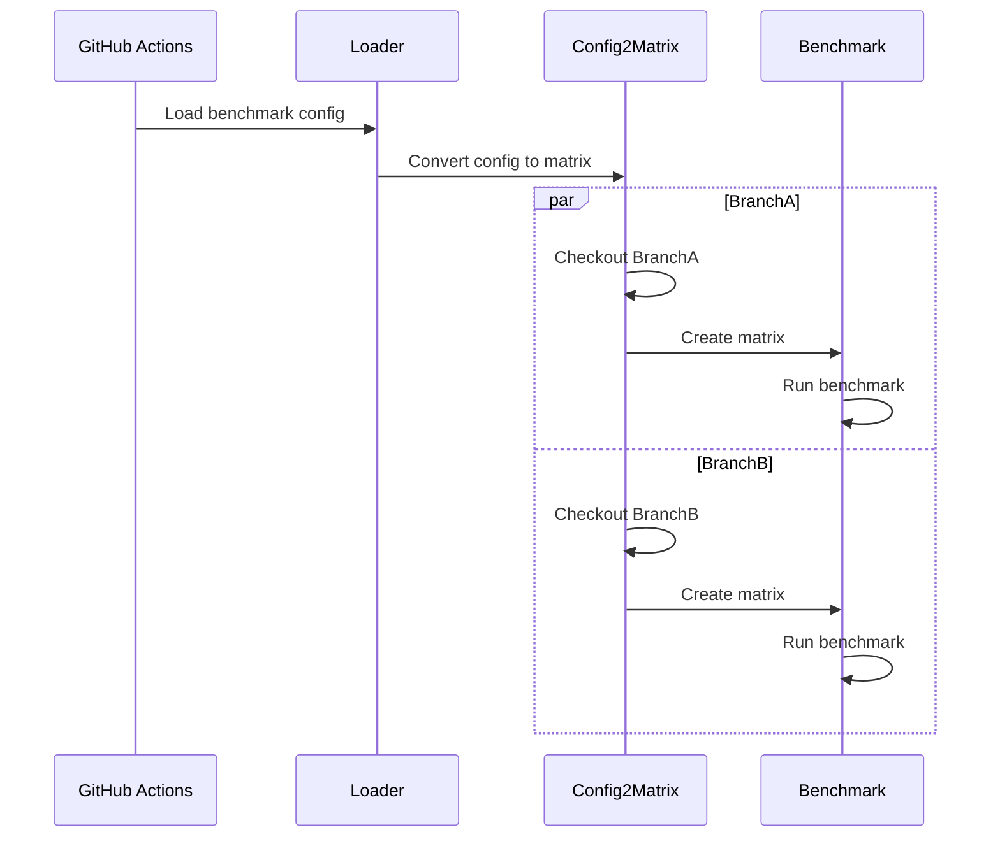

# Diagrams

This sequence diagram indicate how to load benchmark config. `type: loader` config will load the benchmark config from the file path and branch specified.

```mermaid
sequenceDiagram
    participant gha as GitHub Actions
    participant loader as Loader
    participant config2matrix as Config2Matrix
    participant benchmark as Benchmark

    gha->>loader: Load benchmark config
    loader->>config2matrix: Convert config to matrix
    par BranchA
      config2matrix->>config2matrix: Checkout BranchA
      config2matrix->>benchmark: Create matrix
      benchmark->>benchmark: Run benchmark
    and BranchB
      config2matrix->>config2matrix: Checkout BranchB
      config2matrix->>benchmark: Create matrix
      benchmark->>benchmark: Run benchmark
    end
```
