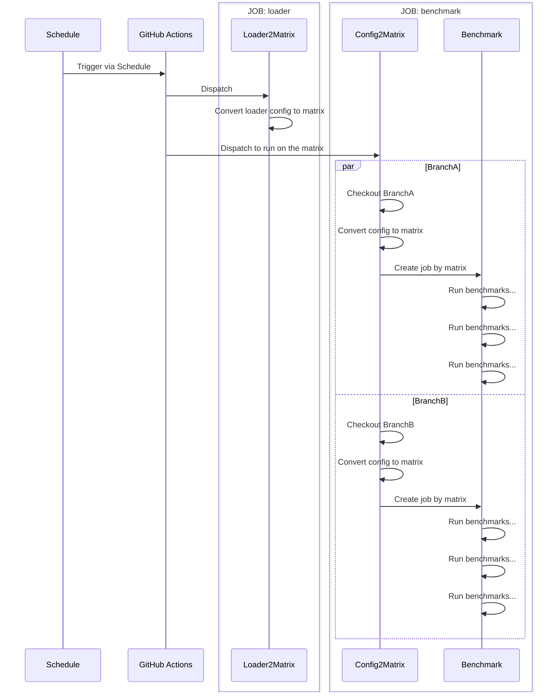
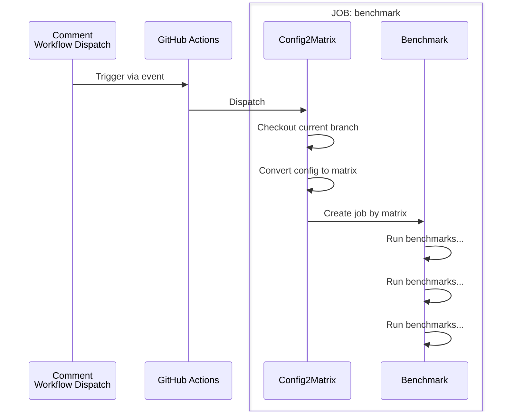

<!-- START doctoc generated TOC please keep comment here to allow auto update -->
<!-- DON'T EDIT THIS SECTION, INSTEAD RE-RUN doctoc TO UPDATE -->
# 📖 Table of Contents

- [Architecture](#architecture)
  - [Benchmark Loader config](#benchmark-loader-config)
  - [Benchmark config](#benchmark-config)
- [Spec](#spec)
  - [Loader config](#loader-config)
    - [YAML Schema](#yaml-schema)
    - [Output Matrix Schema](#output-matrix-schema)
    - [YAML Example](#yaml-example)
    - [Implementation](#implementation)
    - [Conversion Example](#conversion-example)
  - [Benchmark config](#benchmark-config-1)
    - [YAML Schema](#yaml-schema-1)
    - [Template Placeholder Syntax](#template-placeholder-syntax)
    - [Output Matrix Schema](#output-matrix-schema-1)
    - [YAML Example](#yaml-example-1)
    - [Implementation](#implementation-1)
    - [Conversion Example](#conversion-example-1)
- [Practical Example](#practical-example)

<!-- END doctoc generated TOC please keep comment here to allow auto update -->

# Architecture

This document describes the architecture of the benchmark dispatch system. The system is designed to dispatch benchmarks for multiple branches and configurations.

```
┌─────────────────────────────────────────────────────────────────┐
│  Caller repositories (e.g., MagicOnion)                         │
│  └─ workflow_call → benchmark-loader.yaml                       │
└───────────────────────────┬─────────────────────────────────────┘
                            ▼
┌─────────────────────────────────────────────────────────────────┐
│  TIER 1: benchmark-loader.yaml                                  │
│  ├─ verify: User authentication (benchmark-runnable)            │
│  └─ loader2matrix: YAML → Matrix JSON (BenchmarkLoader2Matrix)  │
│       └─ Output: {include: [{benchmarkName, branch, config}]}   │
└───────────────────────────┬─────────────────────────────────────┘
                            ▼
┌───────────────────────────────────────────────────────────────────┐
│  TIER 2: benchmark-execute.yaml (parallel runs via matrix)        │
│  ├─ config2matrix: Job YAML → Matrix JSON (BenchmarkConfig2Matrix)│
│  └─ benchmark: Run benchmarks on Azure ADE VMs                    │
│       ├─ Create VM → setup .NET/apt →                             │
│       │  └─ → git clone → start Server → run Client               │
│       └─ Comment on PR/Issue via benchmark-progress-comment       │
└───────────────────────────────────────────────────────────────────┘
                            ▼
┌─────────────────────────────────────────────────────────────────┐
│  TIER 3: benchmark-cleanup.yaml (scheduled)                     │
│  └─ Automatic cleanup of failed/expired environments            │
└─────────────────────────────────────────────────────────────────┘
```

## Benchmark Loader config

GitHub Actions `schedule` event invoke on default branch only, that's why Loader config is required. `loader2matrix` allow us dispatch benchmark for multiple branches. This sequence diagram indicate how to dispatch the benchmark for multiple branches.

- If you passed loader config, arguments will be treated as loader config. (Loader Mode)
- If you passed config but it is not loader config, arguments will be treated as benchmark config. (Execute Mode)



## Benchmark config

Run the actual benchmark with the configurations defined in the yaml file. The `config2matrix` allow us convert benchmark config to matrix. This sequence diagram indicates how the dispatch works.



# Spec

Configuration file is written in YAML format. There are two types of configuration files: `Loader config` and `Benchmark config`.

## Loader config

Benchmark loader config has `type: loader` and it defines `branch-configs` array. `branch-configs` is array of `branch`, `config` and `suffix` combinations. The loader will load the config for each branch and dispatch the benchmark.

### YAML Schema

| Property | Type | Required | Description |
|----------|------|----------|-------------|
| `type` | `string` | ✅ | Config type indicator. Must be `"loader"` for loader config. If omitted or set to other values, treated as execute mode. |
| `branch-configs` | `array` | ✅ | Array of branch configuration objects. |

**branch-configs[] properties:**

| Property | Type | Required | Description |
|----------|------|----------|-------------|
| `suffix` | `string` | ✅ | Suffix to append to the benchmark name. Use `""` for no suffix. Must be unique across all branch-configs. |
| `branch` | `string` | ✅ | Git branch name to checkout for this benchmark. |
| `config` | `string` | ✅ | Path to the benchmark config YAML file (relative to repository root). |

### Output Matrix Schema

The loader generates a GitHub Actions matrix JSON with the following structure:

| Property | Type | Description |
|----------|------|-------------|
| `include` | `array` | Array of matrix include objects. |
| `include[].benchmarkName` | `string` | Generated benchmark name (`{benchmark-name-prefix}{suffix}`). |
| `include[].branch` | `string` | Branch name to checkout. |
| `include[].config` | `string` | Path to benchmark config file. |

### YAML Example

```yaml
type: loader # Indicate config type. loader is used to define the benchmark loader configuration
branch-configs:
  - suffix: "" # suffix to append to the benchmark name
    branch: "string" # Branch name
    config: "string" # Config path
  # you can define more
```

### Implementation

See [C# BenchmarkLoader2MatrixCommand.cs](src/CysharpActions/Commands/BenchmarkLoader2MatrixCommand.cs) for implementation details.

### Conversion Example

Following config will be converted to GitHub Actions matrix json like follows. benchmark name is passed as `benchmark-123`.

```yaml
type: loader
branch-configs:
  - suffix: ""
    branch: main
    config: ./.github/scripts/tests/template_benchmark_config.yaml
  - suffix: "-1"
    branch: feature/schedule
    config: ./.github/scripts/tests/template_benchmark_config.yaml
```

```json
{
  "include": [
    {
      "benchmarkName": "benchmark-123",
      "branch": "main",
      "config": "./.github/scripts/tests/template_benchmark_config.yaml"
    },
    {
      "benchmarkName": "benchmark-123-1",
      "branch": "feature/schedule",
      "config": "./.github/scripts/tests/template_benchmark_config.yaml"
    }
  ]
}
```

## Benchmark config

GitHub Actions `schedule` event invokes only on the default branch. The loader configuration will allow us to dispatch the benchmark for multiple branches. This sequence diagram indicates how to dispatch the benchmark for multiple branches.

### YAML Schema

**Root properties:**

| Property | Type | Required | Description |
|----------|------|----------|-------------|
| `apt-tools` | `string` | ✅ | APT tool names to install on VMs (space separated). Example: `"libmsquic"` |
| `dotnet-version` | `string` | ✅ | .NET SDK version to install. Example: `"8.0"` |
| `benchmark-location` | `string` | ✅ | Azure region for VM provisioning. Example: `"japaneast"` |
| `benchmark-expire-min` | `integer` | ✅ | Benchmark environment expiration time in minutes. |
| `benchmark-timeout-min` | `integer` | ✅ | Benchmark execution timeout in minutes. |
| `benchmark-client-run-script-path` | `string` | ✅ | Path to client run script (relative to repository root). |
| `benchmark-client-run-script-args` | `string` | ✅ | Client script arguments. Supports `{{ placeholder }}` template syntax. |
| `benchmark-server-run-script-path` | `string` | ✅ | Path to server run script (relative to repository root). |
| `benchmark-server-run-script-args` | `string` | ✅ | Server script arguments. Supports `{{ placeholder }}` template syntax. |
| `benchmark-server-stop-script-path` | `string` | ✅ | Path to server stop script (relative to repository root). |
| `jobs` | `array` | ✅ | Array of benchmark job configurations. At least one job is required. |

**jobs[] properties:**

| Property | Type | Required | Description |
|----------|------|----------|-------------|
| `tags` | `string` | ✅ | Metrics tags for benchmark identification (comma separated). Example: `"legend:messagepack-h2c,protocol:h2c"` |
| `protocol` | `string` | ✅ | gRPC protocol to use. Common values: `"h2c"`, `"h2"`, `"h3"` |
| `channels` | `integer` | ❌ | Number of gRPC channels. Optional. |
| `streams` | `integer` | ❌ | Number of gRPC streams. Optional. |
| `serialization` | `string` | ✅ | Serialization format. Common values: `"messagepack"`, `"memorypack"` |
| `buildArgsClient` | `string` | ❌ | Additional build arguments for client. Used in `{{ buildArgsClient }}` placeholder. |
| `buildArgsServer` | `string` | ❌ | Additional build arguments for server. Used in `{{ buildArgsServer }}` placeholder. |

### Template Placeholder Syntax

Script argument properties (`benchmark-client-run-script-args`, `benchmark-server-run-script-args`) support placeholder replacement using the `{{ key }}` syntax. Placeholders are replaced with corresponding job property values.

**Available placeholders:**

| Placeholder | Source |
|-------------|--------|
| `{{ tags }}` | `jobs[].tags` |
| `{{ protocol }}` | `jobs[].protocol` |
| `{{ channels }}` | `jobs[].channels` |
| `{{ streams }}` | `jobs[].streams` |
| `{{ serialization }}` | `jobs[].serialization` |
| `{{ buildArgsClient }}` | `jobs[].buildArgsClient` |
| `{{ buildArgsServer }}` | `jobs[].buildArgsServer` |

> **Note:** If a placeholder key is not found in the job, it is replaced with an empty string.

### Output Matrix Schema

The config2matrix generates a GitHub Actions matrix JSON with the following structure:

| Property | Type | Description |
|----------|------|-------------|
| `include` | `array` | Array of matrix include objects. |
| `include[].apt-tools` | `string` | APT tools to install. |
| `include[].dotnet-version` | `string` | .NET version to install. |
| `include[].benchmark-location` | `string` | Azure region. |
| `include[].benchmark-expire-min` | `integer` | Environment expiration minutes. |
| `include[].benchmark-timeout-min` | `integer` | Execution timeout minutes. |
| `include[].benchmark-client-run-script-path` | `string` | Client script path. |
| `include[].benchmark-client-run-script-args` | `string` | Client script arguments (placeholders replaced). |
| `include[].benchmark-server-run-script-path` | `string` | Server script path. |
| `include[].benchmark-server-run-script-args` | `string` | Server script arguments (placeholders replaced). |
| `include[].benchmark-server-stop-script-path` | `string` | Server stop script path. |

### YAML Example

```yaml
apt-tools: string # apt tool names to install (space separated)
dotnet-version: string  # dotnet version to install
benchmark-expire-min: number # Benchmark expire time in minutes
benchmark-location: "string" # Benchmark location, indicate azure region
benchmark-timeout-min: number # Benchmark timeout in minutes
benchmark-client-run-script-path: "string" # Benchmark client run script path
benchmark-client-run-script-args: 'string' # Benchmark client run script args (supports {{ placeholder }} template)
benchmark-server-run-script-path: "string" # Benchmark server run script path
benchmark-server-run-script-args: 'string' # Benchmark server run script args (supports {{ placeholder }} template)
benchmark-server-stop-script-path: "string" # Benchmark server stop script path
jobs:
  - tags: string # Metrics Tags (comma separated)
    protocol: h2c|h2|h3 # gRPC Protocol
    channels: number # gRPC Channels (optional)
    streams: number # gRPC Streams (optional)
    serialization: messagepack|memorypack # Serialization
    buildArgsClient: string # Build arguments for client (optional)
    buildArgsServer: string # Build arguments for server (optional)
  # you can define more
```

### Implementation

See [C# BenchmarkConfig2MatrixCommand.cs](src/CysharpActions/Commands/BenchmarkConfig2MatrixCommand.cs) for implementation details.

### Conversion Example

Following config will be converted to GitHub Actions matrix json like follows.

```yaml
apt-tools: libmsquic
dotnet-version: 8.0
benchmark-location: "japaneast"
benchmark-expire-min: 15
benchmark-timeout-min: 10
benchmark-client-run-script-path: ".github/scripts/benchmark-client-run.sh"
benchmark-client-run-script-args: '--run-args "-u http://${BENCHMARK_SERVER_NAME}:5000 --protocol {{ protocol }} -s CI --rounds 3 --channels {{ channels }} --streams {{ streams }} --serialization {{ serialization }} --validate true --tags {{ tags }}" --build-args "{{ buildArgsClient }}"'
benchmark-server-run-script-path: ".github/scripts/benchmark-server-run.sh"
benchmark-server-run-script-args: '--run-args "-u http://0.0.0.0:5000 --protocol {{ protocol }} --validate true --tags {{ tags }}" --build-args "{{ buildArgsServer }}"'
benchmark-server-stop-script-path: ".github/scripts/benchmark-server-stop.sh"
jobs:
  - tags: legend:messagepack-h2c-linux,streams:1,protocol:h2c
    protocol: h2c
    channels: 28
    streams: 1
    serialization: messagepack
    buildArgsClient: ""
    buildArgsServer: ""
```

```json
{
  "include": [
    {
      "apt-tools": "libmsquic",
      "dotnet-version": "8.0",
      "benchmark-expire-min": 15,
      "benchmark-location": "japaneast",
      "benchmark-timeout-min": 10,
      "benchmark-client-run-script-path": ".github/scripts/benchmark-client-run.sh",
      "benchmark-server-run-script-path": ".github/scripts/benchmark-server-run.sh",
      "benchmark-server-stop-script-path": ".github/scripts/benchmark-server-stop.sh",
      "benchmark-client-run-script-args": "--run-args \"-u http://${BENCHMARK_SERVER_NAME}:5000 --protocol h2c -s CI --rounds 3 --channels 28 --streams 1 --serialization messagepack --validate true --tags legend:messagepack-h2c-linux,streams:1,protocol:h2c\" --build-args \"\"",
      "benchmark-server-run-script-args": "--run-args \"-u http://0.0.0.0:5000 --protocol h2c --validate true --tags legend:messagepack-h2c-linux,streams:1,protocol:h2c\" --build-args \"\""
    }
  ]
}
```

# Practical Example

**[Cysharp/MagicOnion](https://github.com/Cysharp/MagicOnion)**

- [Benchmark Config](https://github.com/Cysharp/MagicOnion/tree/main/perf/BenchmarkApp/configs)
- [GitHub Actions](https://github.com/Cysharp/MagicOnion/blob/main/.github/workflows/benchmark.yml)
