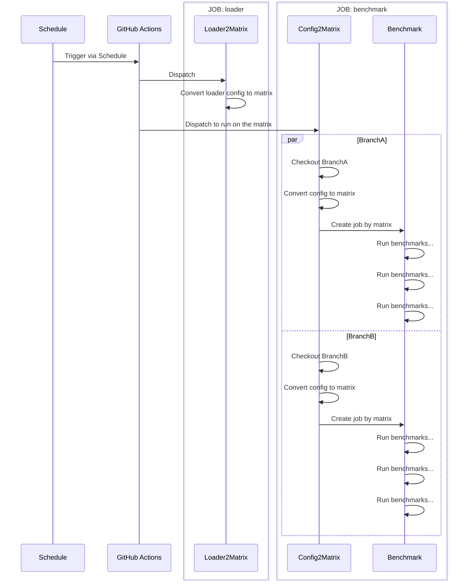
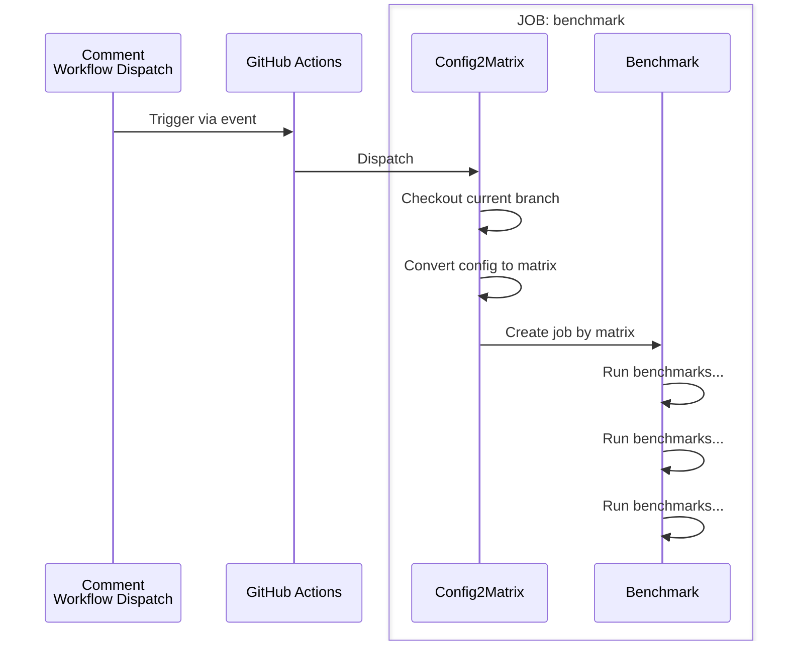

# Architecture

This document describes the architecture of the benchmark dispatch system. The system is designed to dispatch benchmarks for multiple branches and configurations.

## Benchmark Loader config

GitHub Actions `schedule` event invoke on default branch only, that's why Loader config is required. `loader2matrix` allow us dispatch benchmark for multiple branches. This sequence diagram indicate how to dispatch the benchmark for multiple branches.

- If you passed loader config, arguments will be treated as loader config. (Loader Mode)
- If you passed config but it is not loader config, arguments will be treated as benchmark config. (Execute Mode)



## Benchmark config

Run the actual benchmark with the configurations defined in the yaml file. The `config2matrix` allow us convert benchmark config to matrix. This sequence diagram indicates how the dispatch works.



# Spec

Configuration file is written in YAML format. There are two types of configuration files: `Loader config` and `Benchmark config`.

## Loader config

Benchmark loader config has `type: loader` and it defines `branch-configs` array. `branch-configs` is array of `branch`, `config` and `suffix` combinations. The loader will load the config for each branch and dispatch the benchmark.

**SPEC**

```yaml
type: loader # Indicate config type. loader is used to define the benchmark loader configuration
branch-configs:
  - suffix: "" # suffix to append to the benchmark name
    branch: "string" # Branch name
    config: "string" # Config path
  # you can define more
```

**IMPLEMENTATION**

See [C# BenchmarkLoader2MatrixCommand.cs](src/CysharpActions/Commands/BenchmarkLoader2MatrixCommand.cs) for implementation details.

**EXAMPLE**

Following config will be converted to GitHub Actions matrix json like follows. benchmark name is passed as `benchmark-123`.

```yaml
type: loader
branch-configs:
  - suffix: ""
    branch: main
    config: ./.github/scripts/tests/template_benchmark_config.yaml
  - suffix: "-1"
    branch: feature/schedule
    config: ./.github/scripts/tests/template_benchmark_config.yaml
```

```json
{
  "include": [
    {
      "benchmarkName": "benchmark-123",
      "branch": "main",
      "config": "./.github/scripts/tests/template_benchmark_config.yaml"
    },
    {
      "benchmarkName": "benchmark-123-1",
      "branch": "feature/schedule",
      "config": "./.github/scripts/tests/template_benchmark_config.yaml"
    }
  ]
}
```

## Benchmark config

GitHub Actions `schedule` event invokes only on the default branch. The loader configuration will allow us to dispatch the benchmark for multiple branches. This sequence diagram indicates how to dispatch the benchmark for multiple branches.

**SPEC**

```yaml
apt-tools: string # apt tool names to install (space separated)
dotnet-version: number  # dotnet version to install
benchmark-expire-min: number # Benchmark expire time in minutes
benchmark-location: "string" # Benchmark location, indicate azure region
benchmark-timeout-min: number # Benchmark timeout in minutes
benchmark-client-run-script-path: "string" # Benchmark client run script path
benchmark-client-run-script-args: 'string' # Benchmark client run script args (supports {{ placeholder }} template)
benchmark-server-run-script-path: "string" # Benchmark server run script path
benchmark-server-run-script-args: 'string' # Benchmark server run script args (supports {{ placeholder }} template)
benchmark-server-stop-script-path: "string" # Benchmark server stop script path
jobs:
  - tags: string # Metrics Tags (comma separated)
    protocol: h2c|h2|h3 # gRPC Protocol
    channels: number # gRPC Channels
    streams: number # gRPC Streams
    serialization: messagepack|memorypack # Serialization
    buildArgsClient: string # Build arguments for client
    buildArgsServer: string # Build arguments for server
  # you can define more
```

**IMPLEMENTATION**

See [C# BenchmarkConfig2MatrixCommand.cs](src/CysharpActions/Commands/BenchmarkConfig2MatrixCommand.cs) for implementation details.

**EXAMPLE**

Following config will be converted to GitHub Actions matrix json like follows.

```yaml
apt-tools: libmsquic
dotnet-version: 8.0
benchmark-location: "japaneast"
benchmark-expire-min: 15
benchmark-timeout-min: 10
benchmark-client-run-script-path: ".github/scripts/benchmark-client-run.sh"
benchmark-client-run-script-args: '--run-args "-u http://${BENCHMARK_SERVER_NAME}:5000 --protocol {{ protocol }} -s CI --rounds 3 --channels {{ channels }} --streams {{ streams }} --serialization {{ serialization }} --validate true --tags {{ tags }}" --build-args "{{ buildArgsClient }}"'
benchmark-server-run-script-path: ".github/scripts/benchmark-server-run.sh"
benchmark-server-run-script-args: '--run-args "-u http://0.0.0.0:5000 --protocol {{ protocol }} --validate true --tags {{ tags }}" --build-args "{{ buildArgsServer }}"'
benchmark-server-stop-script-path: ".github/scripts/benchmark-server-stop.sh"
jobs:
  - tags: legend:messagepack-h2c-linux,streams:1,protocol:h2c
    protocol: h2c
    channels: 28
    streams: 1
    serialization: messagepack
    buildArgsClient: ""
    buildArgsServer: ""
```

```json
{
  "include": [
    {
      "apt-tools": "libmsquic",
      "dotnet-version": "8.0",
      "benchmark-expire-min": 15,
      "benchmark-location": "japaneast",
      "benchmark-timeout-min": 10,
      "benchmark-client-run-script-path": ".github/scripts/benchmark-client-run.sh",
      "benchmark-server-run-script-path": ".github/scripts/benchmark-server-run.sh",
      "benchmark-server-stop-script-path": ".github/scripts/benchmark-server-stop.sh",
      "benchmark-client-run-script-args": "--run-args \"-u http://${BENCHMARK_SERVER_NAME}:5000 --protocol h2c -s CI --rounds 3 --channels 28 --streams 1 --serialization messagepack --validate true --tags legend:messagepack-h2c-linux,streams:1,protocol:h2c\" --build-args \"\"",
      "benchmark-server-run-script-args": "--run-args \"-u http://0.0.0.0:5000 --protocol h2c --validate true --tags legend:messagepack-h2c-linux,streams:1,protocol:h2c\" --build-args \"\""
    }
  ]
}
```

# Practical Example

**[Cysharp/MagicOnion](https://github.com/Cysharp/MagicOnion)**

- [Benchmark Config](https://github.com/Cysharp/MagicOnion/tree/main/perf/BenchmarkApp/configs)
- [GitHub Actions](https://github.com/Cysharp/MagicOnion/blob/main/.github/workflows/benchmark.yml)
